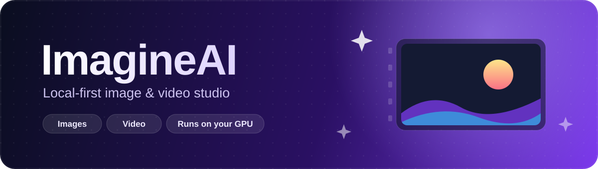
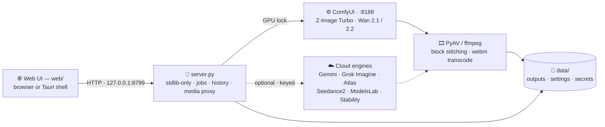

<div align="center">



**A local-first image & video studio.** Your GPU does the work — the cloud is optional, invited by API key only.

<br>


<br>

<a href="#-quick-start">Quick&nbsp;Start</a> ·
<a href="#-feature-tour">Features</a> ·
<a href="#-engine-matrix">Engine&nbsp;Matrix</a> ·
<a href="#-long-form-video">Long-Form&nbsp;Video</a> ·
<a href="#-architecture">Architecture</a> ·
<a href="#-desktop-app">Desktop</a> ·
<a href="#-configuration">Configuration</a> ·
<a href="#-troubleshooting">Troubleshooting</a> ·
<a href="#-safety--privacy">Privacy</a>

</div>

---

ImagineAI is a clean, fast creative cockpit that doesn't send every prompt to a cloud service by default. A **single-file, standard-library-only** Python server (`server.py`) serves a lightweight web UI, drives your local **ComfyUI** install, and keeps settings, keys, and generated media on your machine.

Generate and edit stills with **Z-Image Turbo**, render text-to-image with **FLUX.1 Schnell FP8**, render text-to-video and image-to-video with **Wan 2.1 / Wan 2.2** — and when the GPU is busy, optionally reach for **Gemini, Grok Imagine, Atlas Cloud, Seedance2.ai, ModelsLab, or Stability AI**.

## ⚡ Quick Start

```bash
cd ~/imagineai
./start.sh
```

Then open **http://127.0.0.1:8799** — or run the server directly:

```bash
python3 server.py --port 8799 --open
```

**You need:**

- Python 3 — that's it for the server (no `pip install`, ever)
- A running ComfyUI instance (expected at `http://127.0.0.1:8188`) with the model files used by the bundled Z-Image and Wan workflows
- *Optional:* Node.js + npm, only for the [Tauri desktop build](#-desktop-app)
- *Optional:* API keys for any [cloud engine](#-engine-matrix) you want to enable

## 🎨 Feature Tour

- 🖥️ **Local-first generation** — images via ComfyUI's Z-Image Turbo or FLUX.1 Schnell FP8 workflows; video via Wan 2.2 14B, Wan 2.2 TI2V 5B, or Wan 2.1 1.3B
- 🎬 **Long-form local video** — clips up to **120 s**, rendered as blocks and stitched locally, plus a WanVideoWrapper single-pass path
- 🔗 **Seamless multi-segment cloud video** — Atlas and Grok segments chain from the previous segment's last frame (image-to-video), share one seed, and every seam is crossfaded so the result flows as a single clip
- 🎛️ **Advanced video controls** — a collapsible panel in the Video tab with a **negative prompt** and a **seed** field, wired through to Atlas Wan 2.7, ModelsLab, Seedance (seed), and all local Wan models
- ✏️ **Reference-image editing** — upload an image in the Image tab and edit with local Z-Image, Gemini, Grok Imagine, or Atlas
- 🎞️ **Multiple start images** — in the Video tab: Grok Imagine blends them into one clip; local Wan 2.2 travels through them as keyframes
- ☁️ **Six optional cloud engines** — every key stored locally in `data/secrets.json`, never committed
- 🧵 **Background jobs & history** — generations run as jobs with live status; results land in a local gallery
- 🔀 **Media proxying & model detection** — ComfyUI media served through same-origin endpoints; installed models detected automatically
- 🔐 **GPU lock** — image and video jobs never fight over the same VRAM at the same time
- 🪟 **Browser UI + desktop app** — same interface in your browser or a Tauri v2 shell

## 🧩 Engine Matrix

| Engine | 🖼️ Images | 🎥 Video | ✏️ Reference edit | 🎞️ Start image(s) | Max clip | Key |
|---|:---:|:---:|:---:|:---:|---|---|
| **Z-Image Turbo** — local · ComfyUI | ✅ | — | ✅ | — | — | — |
| **FLUX.1 Schnell FP8** — local · ComfyUI | ✅ | — | — | — | — | — |
| **Wan 2.1 / 2.2** — local · ComfyUI | — | ✅ | — | ✅ multiple → keyframes | 120 s stitched | — |
| **Google Gemini** | ✅ | — | ✅ | — | — | `GEMINI_API_KEY` |
| **xAI Grok Imagine** | ✅ | ✅ | ✅ | ✅ multiple → blended mix | 30 s (15 s per call, stitched) | `XAI_API_KEY` |
| **Atlas Cloud** — Wan 2.7 / Seedream / Kling | ✅ | ✅ | ✅ via edit model | ✅ first image only | 60 s stitched (chained + crossfaded) | `ATLAS_API_KEY` |
| **Seedance2.ai** | 🟡 still frames | ✅ | — | — | 30 s (15 s per call, stitched) | `SEEDANCE_API_KEY` |
| **ModelsLab / Stable Diffusion API** | ✅ | ✅ `wan2.2` / `wan2.6-t2v` | — | — | 120 s (~5 s segments, stitched) | `MODELSLAB_API_KEY` |
| **Stability AI** — `core` / `sd3` / `ultra` | ✅ | — | — | — | — | `STABILITY_API_KEY` |

**How the uploads behave:**

- **Reference images (Image tab)** — wired for local Z-Image Turbo, Gemini, Grok Imagine, and Atlas. Atlas switches to a dedicated image-to-image edit model (default `bytedance/seedream-v4.5/edit`). Seedance, ModelsLab, and Stability stay text-to-image; if a reference is attached, the UI asks you to pick a supported edit engine.
- **Start images (Video tab)** — add up to 8. Grok Imagine **mixes** them all into one clip; local Wan 2.2 TI2V 5B / 14B use them as **keyframes in order**; Atlas image-to-video uses the **first image only**. Seedance and ModelsLab remain text-to-video here — the public Seedance2.ai API only accepts image-to-video inputs as public image URLs, and ImagineAI doesn't upload your local files anywhere.
- **Seedance still frames** — the Image tab reuses Seedance's official video endpoint with `return_last_frame` enabled and saves the returned last frame as a still. This consumes Seedance video credits and creates a short provider-side video task behind the scenes.

## 🎬 Long-Form Video

**Local (up to 120 s)** — the Wan 14B model can't render two minutes in one pass on a small GPU, so ImagineAI has two strategies:

1. **Block renderer** — the clip is generated as short blocks; a lossless PNG of each block's last frame (grabbed inside ComfyUI, *before* H.264 compression) seeds the next block as image-to-video, so continuity holds without artifacts compounding into mush. Blocks that hit an out-of-memory error are automatically retried at a smaller length, then everything is stitched into one file.
2. **WanVideoWrapper path** — if kijai's WanVideoWrapper custom node (plus its umt5 encoder) is installed, the Wan 2.2 TI2V 5B model runs with block-swap streaming transformer blocks through system RAM — fitting on 8 GB VRAM — and keeps one long clip coherent in a **single pass**, no stitching needed.

**Cloud (up to 60 s for Atlas, 30 s for Grok / Seedance, 120 s for ModelsLab)** — anything longer than a single provider segment (15 s for Grok, Seedance, and Atlas Wan 2.7, ~5 s for ModelsLab) is generated as multiple segments and stitched locally. For **Atlas and Grok**, each follow-up segment is generated **image-to-video from the previous segment's last frame** with a shared seed, so motion, characters, and look carry across the seam; if a frame handoff fails (upload block, input moderation) that segment automatically falls back to text-to-video instead of failing the job.

**Stitching & playback** — segments are joined with a **crossfade at every seam** (default 0.5 s, tune or disable with `IMAGINEAI_STITCH_OVERLAP_SECONDS`), which also swallows the duplicated frame that chaining introduces. Concat/crossfade and H.264 → VP9 webm transcoding (so Linux webkit2gtk webviews without an H.264 decoder can play inline) run through **PyAV in ComfyUI's Python environment**, with an **ffmpeg fallback** (xfade-based when clip durations can be probed) resolved from `IMAGINEAI_FFMPEG` / `FFMPEG_BINARY` / `FFMPEG`, your `PATH`, the bundled `node_modules/ffmpeg-static`, or common install locations.

## 🧠 Architecture



Everything flows through `server.py`: it serves the UI, drives ComfyUI workflows, polls cloud providers, proxies media through same-origin endpoints, and stitches video segments locally.

## 💻 Desktop App

Node.js is only needed for this part. Install the tooling once, then:

```bash
npm install            # once
npm run desktop:dev    # Tauri v2 shell in development
npm run desktop:build  # build a desktop package
```

The Tauri build step prepares `desktop-dist/` from the web app. Build output and generated packages are git-ignored.

## 🔧 Configuration

Everything is configurable from **Settings** inside the app: ComfyUI URL, default image engine, Gemini image model + key, xAI image/video models + key, Atlas image/video models, Seedance video model, ModelsLab image/video models (shown when a ModelsLab key is saved), Stability image model (`core`, `sd3`, or `ultra`, shown when a Stability key is saved), and other named API keys for future providers or local helper scripts.

Secrets live in `data/secrets.json` with restrictive permissions where supported — the file is git-ignored. Saved keys other than the built-in providers are shown as masked status hints; unknown provider names are kept for future integrations.

| Provider | Settings key aliases | Env override |
|---|---|---|
| Google Gemini | dedicated field | `GEMINI_API_KEY` |
| xAI Grok Imagine | dedicated field | `XAI_API_KEY` |
| Atlas Cloud | `atlas` · `atlascloud` · `atlas-cloud` | `ATLAS_API_KEY` / `ATLASCLOUD_API_KEY` |
| Seedance2.ai | `seedance` · `seedance2` · `seedance2-ai` | `SEEDANCE_API_KEY` / `SEEDANCE2_API_KEY` |
| ModelsLab | `sdxl` · `modelslab` · `stable-diffusion-api` · `free-api` · `vrije-api` · `wan2.6-t2v` | `MODELSLAB_API_KEY` |
| Stability AI | `stability` · `stability-ai` | `STABILITY_API_KEY` |

> [!TIP]
> Atlas environment variables take **precedence** over saved keys — useful when switching from an Atlas Coding Plan token to a full Atlas Cloud API key.

<details>
<summary><strong>🌍 Environment variables</strong> — full reference</summary>

### Server

| Variable | Default | Purpose |
| --- | --- | --- |
| `IMAGINEAI_HOST` | `127.0.0.1` | HTTP bind host |
| `IMAGINEAI_PORT` | `8799` | HTTP port |
| `IMAGINEAI_DATA_DIR` | `./data` | Local settings, secrets, and outputs |
| `IMAGINEAI_VERBOSE` | empty | Enable verbose request logging |

### ComfyUI & local video

| Variable | Default | Purpose |
| --- | --- | --- |
| `COMFYUI_URL` | `http://127.0.0.1:8188` | ComfyUI base URL |
| `COMFY_PYTHON` | `~/ComfyUI/.venv/bin/python` | ComfyUI venv Python (has PyAV) used for stitching/transcoding |
| `COMFYUI_INPUT_DIR` | `~/ComfyUI/input` | ComfyUI input folder for uploaded images and seed-frame handoff |
| `IMAGINEAI_IMAGE_TIMEOUT` | `600` | Local image job timeout (seconds) |
| `IMAGINEAI_VIDEO_TIMEOUT` | `3600` | Local video job timeout (seconds) |
| `IMAGINEAI_MISSING_HISTORY_GRACE` | `25` | Grace period before a missing ComfyUI history entry counts as failed |
| `IMAGINEAI_LOCAL_MAX_SECONDS` | `120` | Cap for local Wan long-form clips |
| `IMAGINEAI_WAN_BLOCK_SECONDS` | `10` | Target length of each rendered block |
| `IMAGINEAI_WAN_MIN_BLOCK_SECONDS` | `5` | Smallest block length when retrying after OOM |
| `IMAGINEAI_WAN_MAX_DIMENSION` | `576` | Longest-edge cap so the 14B model fits on a small GPU |
| `IMAGINEAI_WAN_MIN_DIMENSION` | `192` | Floor on render dimensions |
| `IMAGINEAI_WAN_CLIP_DEVICE` | `cpu` | Where the ~5 GB umt5-xxl text encoder loads (`default` = GPU) |
| `IMAGINEAI_WAN_CLEAN_SEED_FRAME` | `1` | Seed continuation blocks with a lossless pre-H.264 PNG (`0` = ffmpeg frame grabs) |
| `IMAGINEAI_WANVIDEO_BLOCK_SWAP` | `20` | WanVideoWrapper block-swap depth (0–40) |
| `IMAGINEAI_WANVIDEO_STEPS` | `25` | WanVideoWrapper sampling steps (1–60) |
| `IMAGINEAI_WANVIDEO_T5` | `umt5-xxl-enc-fp8_e4m3fn.safetensors` | kijai umt5 encoder (WanVideoWrapper rejects the Comfy fp8_scaled one) |
| `IMAGINEAI_STITCH_OVERLAP_SECONDS` | `0.5` | Crossfade length at every segment seam when stitching (0–2 s; `0` = hard cut) |
| `IMAGINEAI_FFMPEG` / `FFMPEG_BINARY` / `FFMPEG` | auto-detect | Explicit ffmpeg binary; otherwise `PATH`, bundled `ffmpeg-static`, or common install paths |

### Google Gemini

| Variable | Default | Purpose |
| --- | --- | --- |
| `GEMINI_API_KEY` | empty | Gemini key for cloud image generation |
| `GEMINI_IMAGE_MODEL` | `gemini-2.5-flash-image` | Gemini image model |

### xAI Grok Imagine

| Variable | Default | Purpose |
| --- | --- | --- |
| `XAI_API_KEY` | empty | xAI key for Grok Imagine image/video |
| `XAI_IMAGE_MODEL` | `grok-imagine-image-quality` | xAI image model |
| `XAI_VIDEO_MODEL` | `grok-imagine-video` | xAI video model |
| `XAI_BASE_URL` | `https://api.x.ai/v1` | xAI API base URL |
| `IMAGINEAI_XAI_VIDEO_TIMEOUT` | `1200` | xAI video polling timeout (seconds) |

### Atlas Cloud

| Variable | Default | Purpose |
| --- | --- | --- |
| `ATLAS_API_KEY` / `ATLASCLOUD_API_KEY` | empty | Atlas Cloud key for image/video generation |
| `ATLAS_IMAGE_MODEL` / `ATLASCLOUD_IMAGE_MODEL` | `seedream-3.0` | Atlas Cloud image model |
| `ATLAS_IMAGE_EDIT_MODEL` | `bytedance/seedream-v4.5/edit` | Atlas image-to-image model used for reference edits |
| `ATLAS_VIDEO_MODEL` / `ATLASCLOUD_VIDEO_MODEL` | `alibaba/wan-2.7/text-to-video` | Atlas Cloud text-to-video model |
| `ATLAS_I2V_MODEL` / `ATLASCLOUD_I2V_MODEL` | `alibaba/wan-2.7/image-to-video` | Atlas Cloud image-to-video model used when a start image is attached |
| `ATLAS_WAN27_RESOLUTION` | `1080P` | Atlas Wan 2.7 resolution (`720P`, `1080P`, `1080P-SR`, or `1440P-SR`) |
| `ATLAS_WAN27_AUDIO` | empty | Optional Wan 2.7 soundtrack URL (`wav` or `mp3`) |
| `ATLAS_WAN27_PROMPT_EXTEND` | `true` | Enables Atlas prompt enhancement for Wan 2.7 |
| `ATLAS_WAN27_SEED` | `-1` | Wan 2.7 seed, with `-1` for random |
| `ATLAS_MODERATION_RETRIES` | `2` | Extra retries when Wan 2.7's output moderation false-positives (0–5) |
| `ATLAS_BASE_URL` / `ATLASCLOUD_BASE_URL` | `https://api.atlascloud.ai/api/v1` | Atlas Cloud API base URL |
| `IMAGINEAI_ATLAS_IMAGE_TIMEOUT` | `600` | Atlas image polling timeout (seconds) |
| `IMAGINEAI_ATLAS_VIDEO_TIMEOUT` | `1200` | Atlas video polling timeout (seconds) |

### Seedance2.ai

| Variable | Default | Purpose |
| --- | --- | --- |
| `SEEDANCE_API_KEY` / `SEEDANCE2_API_KEY` | empty | Seedance2.ai key for still-frame/video generation |
| `SEEDANCE_VIDEO_MODEL` / `SEEDANCE2_VIDEO_MODEL` | `seedance-2-0` | Seedance video model (`seedance-2-0` or `seedance-2-0-fast`) |
| `SEEDANCE_RESOLUTION` / `SEEDANCE2_RESOLUTION` | `720p` | Seedance output resolution (`480p`, `720p`, `1080p`, or `4k`) |
| `SEEDANCE_BASE_URL` / `SEEDANCE2_BASE_URL` | `https://api.seedance2.ai` | Seedance2.ai API base URL |
| `IMAGINEAI_SEEDANCE_VIDEO_TIMEOUT` | `1800` | Seedance video polling timeout (seconds) |

### ModelsLab & Stability AI

| Variable | Default | Purpose |
| --- | --- | --- |
| `MODELSLAB_API_KEY` | empty | ModelsLab key for SDXL image/video generation |
| `MODELSLAB_IMAGE_MODEL` | `sdxl` | ModelsLab image model ID |
| `MODELSLAB_VIDEO_MODEL` | `wan2.2` | Default ModelsLab text-to-video model ID |
| `MODELSLAB_WAN26_VIDEO_MODEL` | `wan2.6-t2v` | ModelsLab model ID used by the dedicated `wan2.6-t2v` video chip |
| `MODELSLAB_BASE_URL` | `https://modelslab.com` | ModelsLab API base URL |
| `STABILITY_API_KEY` | empty | Stability/SDXL key for cloud image generation |
| `STABILITY_IMAGE_MODEL` | `core` | Stability image model: `core`, `sd3`, or `ultra` |
| `STABILITY_BASE_URL` | `https://api.stability.ai` | Stability API base URL |

</details>

## 📁 Project Layout

```text
imagineai/
├── server.py        # stdlib HTTP server · jobs · ComfyUI bridge · cloud engines
├── start.sh         # local launcher (port 8799)
├── web/             # browser UI — no build step
│   ├── services/    # API clients and generation wrappers
│   └── ui/          # prompt, gallery, history, settings, tabs
├── src-tauri/       # Tauri v2 desktop shell
├── scripts/         # launch/build helpers
├── tests/           # stdlib unittest suite (provider calls mocked)
├── assets/          # banner artwork
└── data/            # git-ignored: settings, secrets, outputs
```

Run the tests with plain unittest — no extra packages, network, or GPU required:

```bash
python3 -m unittest discover -s tests
```

## 🩺 Troubleshooting

<details>
<summary><strong>ModelsLab returns 403</strong></summary>

For images, ImagineAI first tries the high-quality `/api/v6/images/text2img` endpoint. If ModelsLab returns 403 because that feature isn't on your plan, it automatically falls back to `/api/v6/realtime/text2img`. ModelsLab **video** 403s are reported as plan/feature access errors — there's no equivalent text-to-video fallback.

</details>

<details>
<summary><strong>Atlas video fails with a Coding Plan token</strong></summary>

Atlas Coding Plan tokens can *list* video models but get 403 on video *generation*. Use a full Atlas Cloud API key/plan for Atlas video, or use ModelsLab, xAI, or local Wan instead. Atlas environment variables take precedence over keys saved in Settings, which makes switching tokens easy.

</details>

<details>
<summary><strong>Atlas Wan 2.7 rejects harmless prompts</strong></summary>

Wan 2.7's output content filter (copyright/IP/sensitive-content) is stochastic and often misfires; flagged clips are automatically retried (`ATLAS_MODERATION_RETRIES`, default `2`, max `5`). Requests to Atlas also send a browser-like User-Agent, because Atlas sits behind Cloudflare's bot filter (403 "error code: 1010" otherwise).

</details>

<details>
<summary><strong>Seedance stills use video credits</strong></summary>

The Image tab's Seedance engine calls the official video endpoint with `return_last_frame` enabled and saves the returned last frame as a still. This consumes Seedance video credits and creates a short provider video task behind the scenes. Seedance image-to-video needs public image URLs, so local reference/start images are not supported for Seedance.

</details>

<details>
<summary><strong>Long videos won't stitch</strong></summary>

Segment stitching prefers PyAV from the ComfyUI Python environment (`COMFY_PYTHON`), then falls back to ffmpeg from `IMAGINEAI_FFMPEG` / `FFMPEG_BINARY` / `FFMPEG`, your `PATH`, common install locations, or the bundled `ffmpeg-static` npm package. Make sure at least one of these is available.

</details>

<details>
<summary><strong>Image and video jobs feel serialized</strong></summary>

That's intentional: heavy ComfyUI jobs run behind a process-wide GPU lock so image and video generation don't fight over the same VRAM at the same time.

</details>

## 🔒 Safety & Privacy

- 🔑 `data/secrets.json` and `data/settings.json` stay local with restrictive permissions where supported, and are git-ignored along with generated outputs, build artifacts, `node_modules/`, and Python caches.
- 🏠 The server binds to `127.0.0.1` by default — nothing is exposed to your network unless you change it.
- 🔁 ComfyUI media is proxied through same-origin local endpoints; the browser never talks to ComfyUI or cloud providers directly.
- 🧱 Heavy ComfyUI jobs run behind a process-wide GPU lock, so image and video generations never fight over the same VRAM.
- ☁️ Cloud engines are strictly opt-in: no key saved, no request sent.

## 📜 License

<div align="center">

MIT — see [LICENSE](LICENSE).

<sub>Made for people who like their pixels rendered at home.</sub>

</div>
